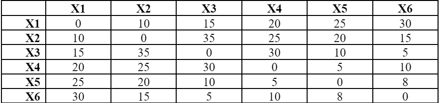
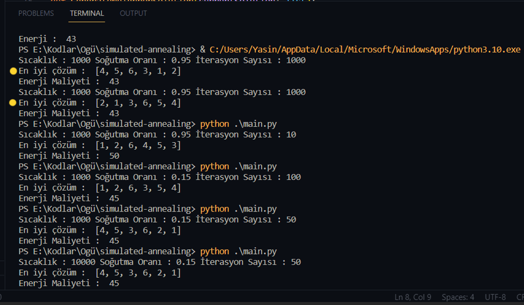

# Simulated Annealing (Benzetimli Tavlama) Algoritması 

Tavlama, metalin yapısını optimize etmek amacıyla kullanılan bir metalurji yöntemidir. Simulated Annealing (SA) algoritması, bu fiziksel süreci taklit ederek global optimumu bulma ve çözümü eniyileme amacını taşır. SA, özellikle karmaşık ve maliyetli problemlerde kullanılarak, olasılıksal bir yaklaşım ve enerji seviyelerini kullanarak çeşitli çözüm alanlarını keşfeder.

### Daha detaylı bilgi için:

Daha detaylı rapora ulaşmak için Notion sayfamı ziyaret edebilirsiniz.

* [ Notion](https://dawn-squash-710.notion.site/Simulated-Annealing-02cbf4982e7c4f86bdab6603c81bfd2a)


### Sözde Kod ve Çalışma Mantığı

```javascript
function SimulatedAnnealing(initialSolution, initialTemperature, coolingRate, maxIterations):
    currentSolution = initialSolution
    bestSolution = currentSolution
    temperature = initialTemperature
    
    for i=1 to maxIterations:
        newSolution = GenerateNeighborSolution(currentSolution)
        currentEnergy = EvaluateEnergy(currentSolution)
        newEnergy = EvaluateEnergy(newSolution)

        if (newEnergy < currentEnergy) or AcceptanceProbability(currentEnergy, newEnergy, temperature) > random(0,1):
            currentSolution = newSolution
            if newEnergy < EvaluateEnergy(bestSolution):
                bestSolution = newSolution

        temperature = temperature * coolingRate
    
    return bestSolution
```

Bu algoritmanın temel mantığı, enerji düzeyini optimize etmek için olasılıksal bir yaklaşım kullanmaktır. Başlangıç çözümünden başlayarak belirli bir sıcaklıkta çözümler üretilir ve enerji seviyeleri karşılaştırılarak çözümün kabul edilip edilmeyeceği belirlenir. Sıcaklık azaldıkça algoritma, daha iyi çözümlere odaklanma eğilimindedir. Soğuma oranı, algoritmanın performansını büyük ölçüde etkiler.


Algoritma Açıklaması:

* Başlangıç çözümü, ilk çözüm, sıcaklık ve soğuma oranı gibi parametrelerle başlar.
* Her iterasyonda yeni bir çözüm üretilir ve enerji seviyeleri karşılaştırılır.
* Metropolis Kriteri kullanılarak çözümün kabul edilip edilmeyeceğine karar verilir.
* Sıcaklık azaldıkça, algoritma daha iyi çözümlere odaklanır.
* Iterasyonlar devam ettikçe, en iyi çözüm güncellenir.
* Sonunda en iyi çözüm geri döndürülür.

### Metropolis Kriteri
Metropolis Kriteri, önerilen bir değişikliğin kabul edilip edilmeyeceğini belirler. Bu algoritma için kabul olasılığı, enerji farkı ve sıcaklığa bağlı olarak belirlenir.


### Problem Tanımı

Bu algoritma, bir şehirler arası seyahat problemi için uygulanmıştır. Şehirler arası seyahat problemi, bir dizi şehir ve her şehir arasındaki mesafelerin verildiği bir problem türüdür. Bu problemde, her şehir sadece bir kez ziyaret edilebilir ve her şehir arasındaki mesafeler bilinmektedir. Amaç, tüm şehirleri ziyaret eden ve en kısa mesafeyi kateden bir yol bulmaktır.

Şehirlerin birbirine olan uzaklıkları, aşağıdaki gibi bir matris ile verilmiştir.




### Algoritmanın Uygulanması

Algoritma uygulandıkta sonra problem için uygun çözümlerin farklı parametrelerle aşağıdaki gibi olduğu görülmüştür.

<div align="center">
    
</div>

